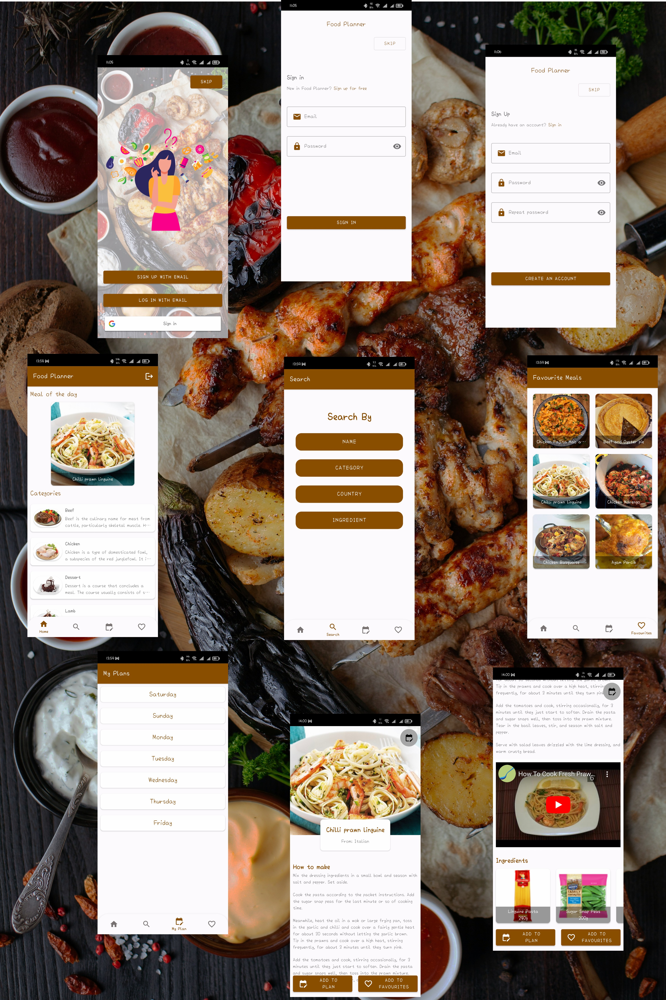

# Food Planner

--------------
Food Planner is a native Android mobile application that uses Java to help users plan their weekly meals.
 It enables users to view a variety of recipes from around the world and provides the ability to view categories, suggest meals, and search for specific meals using various options.

Application Features:
--------------------
* Auth with email and password or with google.
* The user can also remain anonymous and enter as guest.
* View meal for inspiration in the home page.
* Search for meals by name, area, category or ingredient.
* Clicking on any meal opens a detailed view with how to make instructions, ingredients and a video that explains how to prepare it.
* Logged in users can add meals to their favourites and view them later even without network connectivity
* Logged in users can also add the meal to the Calendar and get notified about the meals at a later date.

## Tools used
* MVP Architecture Pattern
* Repository Design Pattern
* Rx Java
* Room
* Retrofit
* Glide
* Recycler View
* Material Design 2
* Firebase Authentication
* Firebase Firestore
* Lottie Animation
* Navigation Component

## API used
[TheMealDB API](https://www.themealdb.com/api.php)

## Downloads
[APK Download](https://drive.google.com/file/d/1ZKGZzan96F25DmUfJFWAyZvRzuu_eKie/view?usp=sharing)

## Screenshots

  

